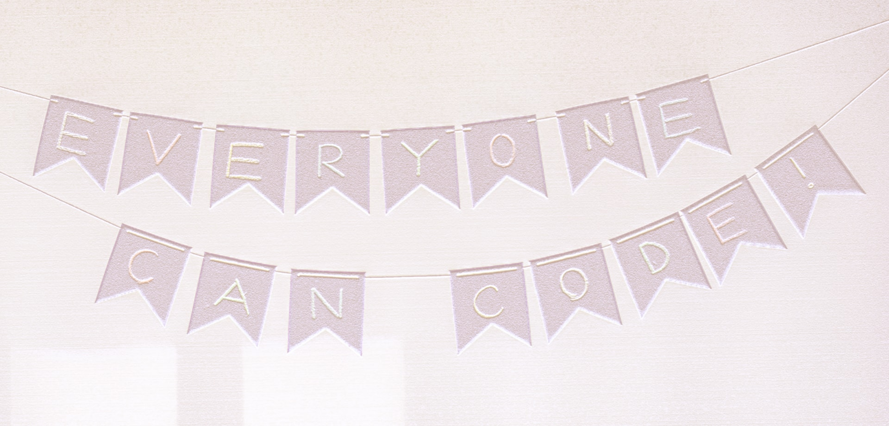

# codeschool-webdev

### Getting started with making static websites using HTML/CSS/JS

Have you wondered what if you could write some code and make some magic on the web? Guess what? Coding is not scary, however, the thought of it can be. Based on my own learnings, here’s a practical approach to get you started on the path of coding for the web!

What to expect?

* Familiarise with the basic stuff that you need to make a static website   
* Follow along and learn how to build your first website
* Code management and web-hosting using GitHub  
* A bunch of  tutorials to showcase your designs on the web
* Find more resources and tutorials to sharpen your skills

### [Check out the tutorial docs](https://bit.ly/codeschool-webdev)